# Soulstone Survivors Tweaks
 A Cheat / Tweak mod for the Steam Game [Soulstone Survivors](https://store.steampowered.com/app/2066020/Soulstone_Survivors/), providing access to a bunch of tweaks to make the game infinitely harder, or cheatily easy. 
 
 Quick examples of what you can do: 
 - Modify EXP gain, player stats, enemy stats
 - Invulnerability
 - Disable AI 
 - remove obstacles from the map (RIP Trees)
 - etc.

 Built for Soulstone Survivors `Early Access 0.11.038a - Windows`.

 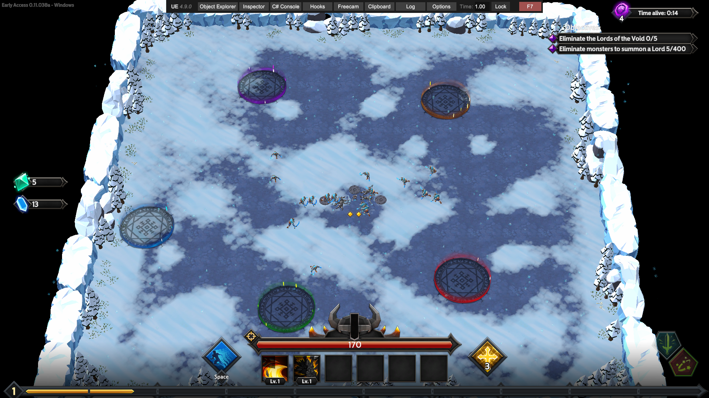

# Installation

This mod requires **BepInEx v6 (Bleeding Edge)**. Developed using [Build #666](https://builds.bepinex.dev/projects/bepinex_be), but you can try if a newer build works too.

Unpack BepInEx into your game folder (usually something like `C:\Program Files (x86)\Steam\steamapps\common\Soulstone Survivors`), and run the game once.

You should now have a `BepInEx/plugins` folder. Drop the `SoulstoneTweaks.dll` in there and you're good to go. After starting the game again, a config file will be created under `BepInex/configs/SoulstoneTweaks.cfg`.

If you prefer building it yourself from the source code, just download the source, and run `dotnet build` (assuming you have .NET installed). The DLL should then be located in `bin/Debug/net6.0` (version number might differ).

# Configuration & Features

NOTE: Configs do not get applied while the game is running, changing the config requires a restart!

## Misc Features

|Config Entry|Default|Description||
|:----:|:---:|:---:|:---:|
|`Disable_Enemy_A_I`|`false`| When enabled, enemy AI is completely turned off. No attacks, no movement. **Note**: Boss health bars do not properly disappear after their death if they have no AI. This prevents further bosses from spawning, so only use as a gimmick. ||
|`Unlock_Zoom`|`false`| Allows you to zoom in / out using your scroll wheel |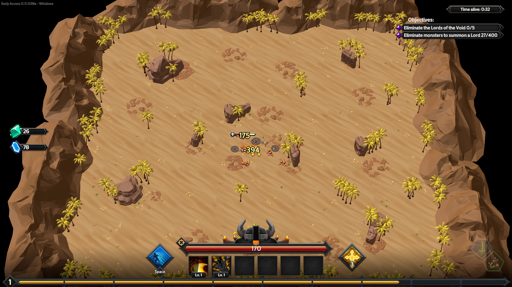|
|`Invulnerable`|`false`| Makes you completely invulnerable ||
|`Time_Modifier`|`1.0`| Modifies game speed (affects **everything**). E.g. `2.0` doubles it.||
|`Remove_Map_Obstacles`|`false`| Do you hate trees? This option removes **ALL** obstacles from the map. Note: This may or may not work for future added maps.||
|`Extra_Minerals_Spawn_Delay`|`-1`| Spawns a new mineral every `n` seconds. E.g. when set to `0.1`, spawns 10 minerals per second. Disabled when negative.|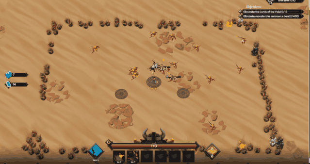|
|`Auto_Unlock_Special_Portals`|`false`|Automatically opens special portals (e.g. to Secret Bosses) at the end of the round||

## Global Features

These features affect some global game stats, like costs, weapon stats, etc.

|Config Entry|Default|Description||
|:----:|:---:|:---:|:---:|
|`Skill_Tree_Cost_Multiplier`|`1.0`| Multiplier for all skill costs in the skill tree. Example: `2.0` doubles everything, `0` makes all skills free.||
|`Weapon_Strength_Multiplier`|`1.0`| Modifies strength of weapon bonus effects|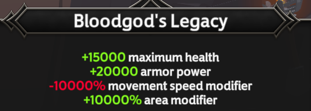|
|`Weapon_Unlock_Cost_Multiplier`|`1.0`| Modifies cost of weapon unlocks. When set to `0`, all weapons are (nearly) free, you still need to own at least 1 of each required item.|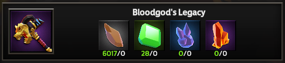|
|`Character_Stats_Multiplier`|`1.0`| Modifies strength of character stat bonuses|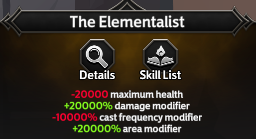|
|`Character_Unlock_Cost_Multiplier`|`1.0`| Modifies cost of character unlocks. When set to `0`, all characters are free.||
|`Runic_Power_Multiplier`|`1.0`|Modifies your runic power limit||

## Curse Modifiers

|Config Entry|Default|Description||
|:----:|:---:|:---:|:---:|
|`Curse_Bonus_Multiplier`|`1.0`| Multiplier for all curse level bonuses|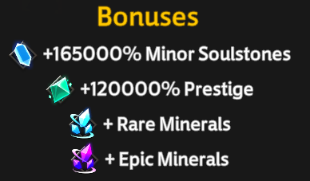|
|`Curse_Level_Strength_Multiplier`|`1.0`| Multiplier for the curse intensity effects|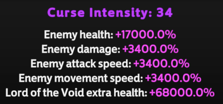|

## Loot Multipliers (Soulstone, Experience, Prestige, etc.)

|Config Entry|Default|Description||
|:----:|:---:|:---:|:---:|
|`Minor_Soulstone_Multiplier`|`1.0`| Modifies **Minor Soulstone** gain during a game||
|`Boss_Soulstone_Multiplier`|`1.0`| Modifies the amount of big soulstones obtained from bosses (still only drops one item visually)||
|`Health_Pickup_Amount_Multiplier`|`1.0`| Modifies the amount of health obtained from health pickups (e.g. health crystals). **Note**: You can also set this to a negative value, making you lose health instead.||
|`Item_Drop_Amount_Multiplier`|`1.0`| Modifies the amount of materials you obtain on pickup (iron, etc.)||
|`Experience_Multiplier`|`1.0`| Modifies the character experience gain (ingame level)|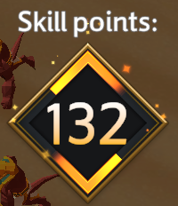|
|`Prestige_Multiplier`|`1.0`| Modifies the character prestige gain (prestige level)||

## Enemy Modifiers

|Config Entry|Default|Description|
|:----:|:---:|:---:|
|`Boss_Health_Multiplier`|`1.0`| Modifies health of bosses|
|`Elite_Health_Multiplier`|`1.0`| Modifies health of elites|
|`Small_Enemy_Health_Multiplier`|`1.0`| Modifies health of regular enemies|

Note: When setting this to 0, they effectively die with a single attack.

## Objective Modifiers

|Config Entry|Default|Description||
|:----:|:---:|:---:|:---:|
|`Enemy_Objective_Multiplier`|`1.0`| Modifies the amount of enemies you need to kill for the next wave of bosses to spawn||

## Player Inventory (Rerolls, Banishes, Locks)

|Config Entry|Default|Description||
|:----:|:---:|:---:|:---:|
|`Additional_Rerolls`|`0`| Gives additional Rerolls||
|`Infinite_Rerolls`|`false`| Locks Reroll count at 1000|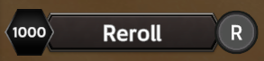|
|`Additional_Banishes`|`0`| Gives additional Banishes||
|`Infinite_Banishes`|`false`| Locks Banish count at 1000|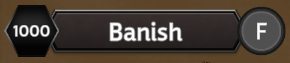|
|`Additional_Locks`|`0`| Gives additional Locks||
|`Infinite_Locks`|`false`| Locks Lock count at 1000|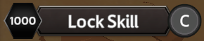|
|`Additional_Death_Guards`|`0`|Gives additional Death Guards|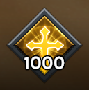|

Note: There is no infinite Death Guards, since then you might as well use `Invulnerable`.

## Player Stats

You can modify the each stat of the player as you desire. There are two sections in the config, one for `[Player.BaseStats]` and one `[Player.MultiplicativeStats]`. Changes under the `[Player.BaseStats]` are additive bonuses (e.g. start the game with +100% more damage), while `[Player.MultiplicativeStats]` increases the multiplicative stat on top of all your additive values (e.g. double your damage, including all scaling you obtain from power-ups).

So make sure you edit the one that you want to change (check in which section it is in the config).

|Config Entry|Default|Description||
|:----:|:---:|:---:|:---:|
|`Dash_Count`|`0`| Gives you additional dashes|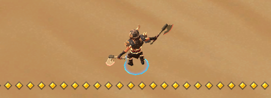|
|`Max_Health_Modifier`|`0`|Increases Player Max Health by the specified amount||
|`Crit_Chance_Modifier`|`0`|Increases Player Crit Chance by the specified amount. E.g. `0.2` increases it by `20%`||
|`Crit_Damage_Modifier`|`0`|Increases Player Crit Damage by the specified amount. E.g. `0.2` increases it by `20%`||
|`Damage_Modifier`|`0`|Increases Player Damage by the specified amount. E.g. `0.2` increases it by `20%`||
|`Healing_Modifier`|`0`|Increases Player Healing by the specified amount. E.g. `0.2` increases it by `20%`||
|`Attack_Speed_Modifier`|`0`|Increases Player Attack Speed by the specified amount.||
|`Collect_Range_Modifier`|`0`|Increases Player Collection Range by the specified amount. E.g. `0.2` increases it by `20%`||
|`Damage_Reduction_Modifier`|`0`|Increases Player Damage Reduction by the specified amount. E.g. `0.2` increases it by `20%`||
|`Movement_Speed_Modifier`|`0`|Increases Player Movement Speed by the specified amount. E.g. `0.2` increases it by `20%`||
|`Area_Modifier`|`0`|Increases Player Area by the specified amount. E.g. `0.2` increases it by `20%`||
|`Armor_Modifier`|`0`|Increases Player Armor by the specified amount. E.g. `0.2` increases it by `20%`||
|`Base_Skill_Cooldowns`|`0`|Increases Player Skill Cooldown by the specified amount. E.g. `0.2` increases it by `20%`||
|`Block_Chance`|`0`|Increases Player Block Chance by the specified amount. E.g. `0.2` increases it by `20%`||
|`Extra_Cast_Modifier`|`0`|Increases Player Multicast by the specified amount. E.g. `0.2` increases it by `20%`||

