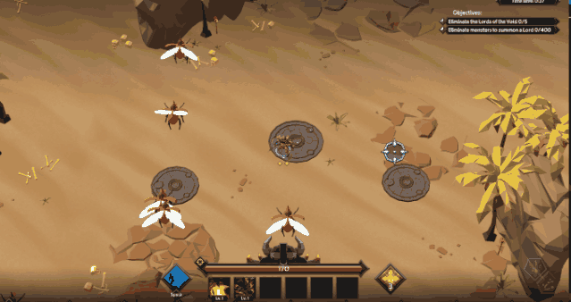

# Soulstone-Survivors-Tweak-Mod
 A BepInEx mod for the Steam Game 'Soulstone Survivors', providing access to a bunch of tweaks to make the game infinitely harder, or cheatily easy.
 Built for Soulstone Survivors `Early Access 0.11.038a - Windows`.

# Installation

This mod requires BepInEx v6 (Bleeding Edge), due to Soulstone Survivors using IL2CPP which is only supported by BepInEx v6. Developed using [Build #666](https://builds.bepinex.dev/projects/bepinex_be).
Unpack BepInEx into your game folder (usually something like `C:\Program Files (x86)\Steam\steamapps\common\Soulstone Survivors`), and run the game once.

You should now have a `BepInEx/plugins` folder. Drop the `SoulstoneTweaks.dll` in there and you're good to go. After starting the game again, a config file will be created under `BepInex/configs/SoulstoneTweaks.cfg`.

# Configuration & Features

NOTE: Configs do not get applied while the game is running, changing the config requires a restart!

### Disable Enemy AI

Config: `Disable_Enemy_A_I`
When set to `true`, enemy AI is completely turned off. No attacks, no movement, just quietly waiting for their demise.

